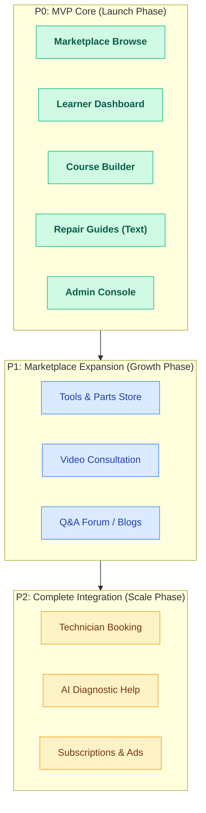

# 03 — Features & Scope

Turns the Project Definition into a concrete, prioritized feature list. Features are tagged by priority — **P0 (MVP, must-have)**, **P1 (fast-follow)**, **P2 (full ecosystem)** — and by the panel that owns them.

---

---

## Guiding principle

Everything that goes public passes through **admin review** first. Nothing — course, guide, product, blog/vlog, expert, technician, forum answer — goes live until approved. Trust is the product.

---

## P0 — MVP (must-have to launch)

### 1. Public marketplace (Browse)

- Home with search, popular categories, featured & free courses, offer banner.
- Category browse + filters (level, sort, price), keyword search.
- Course detail: curriculum (expandable), free preview, instructor, reviews, ratings.
- Course player (video + lesson list).

### 2. Learner experience

- Sign up / log in (learner or instructor intent).
- Enroll in a course.
- Learner dashboard: continue learning, my courses + progress, wishlist, streak.

### 3. Instructor experience — three ways to create a course

- Instructor dashboard: overview, earnings snapshot, my courses with status.
- **A. Self-Produced** — instructor films with their own camera, edits, and uploads via the **course builder**. Sets their own course price; **platform commission ~20% (instructor keeps ~80%)**. → Save draft → **Submit for review**.
- **B. We Produce For You (managed)** — for instructors who can't shoot/edit. Our team does camera, shooting, editing, thumbnail, upload. **Platform takes ~50–60%** to cover production. Request flow: describe topic → what they can provide → location → production team follows up.
- **C. Sell Your Idea (buy-out)** — instructor pitches only the idea; if SobaiShikhi is interested, it buys the course outright for a **one-time payment** (no commission, platform owns it). Each deal is approved individually by admin.
- All three still pass **admin review** before going live; revision feedback ("fix & resubmit") shows inline.

### 4. Repair Knowledge Hub (iFixit-style, text-first)

- Searchable hub by problem/category (Mobile, Laptop, Appliance, Car, Bike, …).
- Guide cards: difficulty, est. cost (BDT), time, views, success rate.
- Step-by-step guide page: overview, symptoms, causes, tools, safety warnings, numbered steps, common mistakes, prevention.
- Contributor guide builder → submit for review.

### 5. Admin console (the control center)

- **Review Center** — unified approval queue for every content type.
- Content inspection on review: flag lessons/items, write fix notes, edit-as-admin, approve / request revision.
- Manage courses (unpublish, feature), instructors & learners (verify, suspend/ban).
- Categories (add, enable/disable).
- Platform settings (commission rates, payment methods, section toggles, homepage banner).

### 6. Trust & payments

- Verified-instructor / verified-expert badges.
- Local payments: bKash, Nagad, Rocket, Card.
- Bangla-first content; English UI chrome.

---

## P1 — Fast-follow (after MVP traction)

### Commerce

- **Tools & Equipment store** — product cards, details, seller types, reviews.
- **Spare Parts marketplace** — compatibility info, OEM/genuine badge, warranty, related guide.
- **Vendor panel** — list/manage products → admin review → publish.

### Services

- **Expert video consultation** — expert profiles, 15/30/60-min pricing, booking flow, call features.
- **Expert console** — calls, requests, availability, my guides, earnings.

### Community

- **Q&A forum** — ask, upvote, verified-expert answers, best-answer badge, leaderboards.
- **Blog & vlogs** — articles/video posts from experts → admin review.

### Admin (extend)

- **Orders** — full visibility of every purchase (buyer, item, type, seller, amount, status).
- Reputation/badges management, payouts processing.

---

## P2 — Full ecosystem

- **Home-service booking** — verified local technicians, scheduling, live tracking, escrow, service warranty.
- **Technician panel** + admin verification of technicians.
- **AI Repair Assistant** — diagnose symptoms → causes → recommend guides, courses, tools, parts, experts, nearby technicians, est. cost.
- Advertising: sponsored products, featured vendors, sponsored experts.
- Subscriptions, premium certifications, corporate/bulk training.

---

## Roles & their panels (who creates what)

| Role                        | Creates                                  | Reviewed by           |
| --------------------------- | ---------------------------------------- | --------------------- |
| Instructor                  | Courses                                  | Admin → Review Center |
| Repair contributor / Expert | Repair guides, Blog/Vlogs                | Admin                 |
| Expert                      | Video consultations, Q&A answers         | Admin / verification  |
| Vendor                      | Tools & parts listings                   | Admin                 |
| Technician                  | Service listing                          | Admin (verify)        |
| Learner / Buyer             | Reviews, questions, orders               | Moderated             |
| **Admin**                   | Anything (bypasses review); controls all | —                     |

---

## Explicitly OUT of scope (for now)

- Native mobile apps (web responsive first).
- Live group classes / webinars at scale.
- Multi-language beyond Bangla + English.
- Real payment gateway integration (mocked in prototype).
- Real video hosting/streaming infrastructure.

---

## MVP success criteria

- A learner can discover → preview → enroll → learn → track progress.
- An instructor can build → submit → get reviewed → publish → earn.
- A visitor can search a problem → read a step-by-step repair guide.
- Admin can review and approve/reject every piece of content and control commissions & sections.
- All flows work in Bangla with local payment options.
