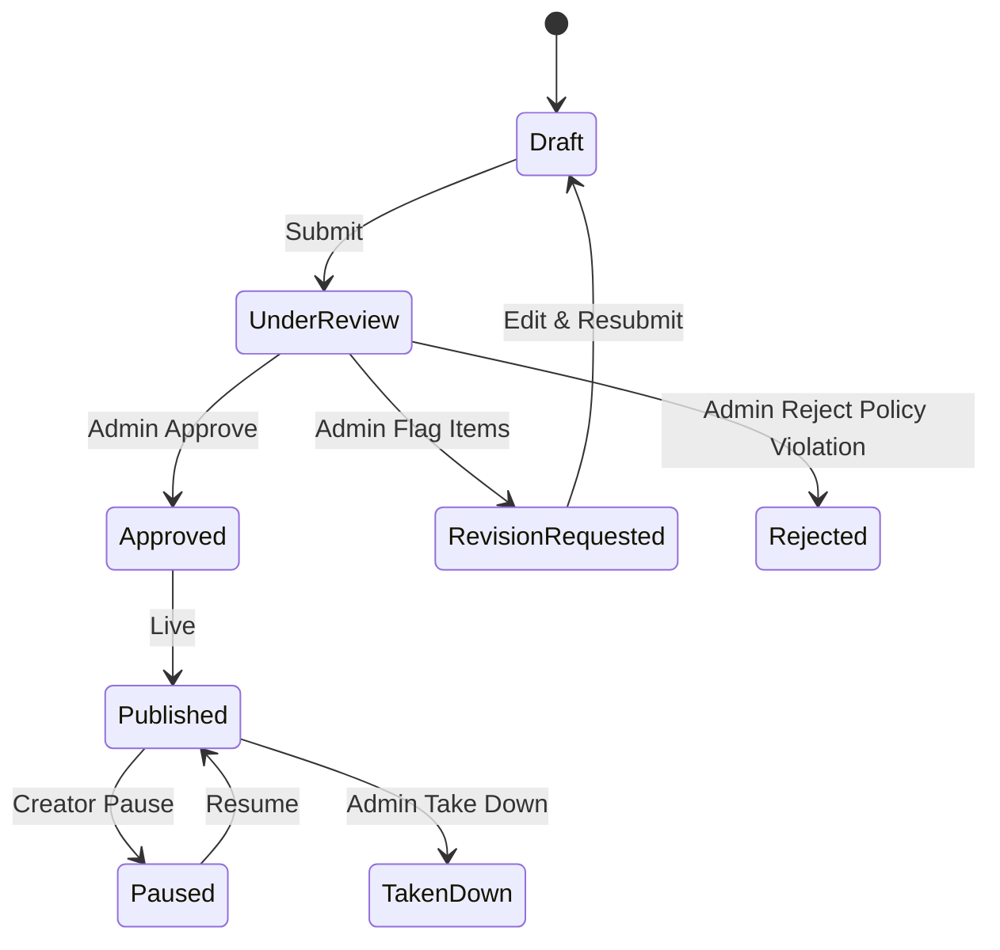

# 04 — User Flows & Journeys

The exact step-by-step paths each user takes through SobaiShikhi. Every public-facing creation flow ends at an **admin review gate** before going live.

---

## 1. Learner — discover → learn

1. Land on **Home** → search a skill or pick a category.
2. **Browse** results → filter by level / sort / price.
3. Open **Course detail** → watch free preview, read curriculum + reviews, check instructor.
4. **Enroll** (pay via bKash / Nagad / card).
5. **Course player** → watch lessons, complete sections.
6. **Learner dashboard** → continue learning, track progress, earn certificate.

**Aha moment:** finishing the first free preview lesson and seeing the full curriculum unlock on enrollment.

---

## 2. Instructor — teach → earn

1. Sign up with **"I want to teach"** intent.
2. **Instructor dashboard** → New Course.
3. **Course builder** → add sections, lessons, pricing, cover → **Save draft**.
4. **Submit for review**.
5. → **Admin Review Center** (see flow 7).
6. If revision requested → see inline **"Admin feedback — fix & resubmit"** → edit → resubmit.
7. On approval → course **published**, appears in browse.
8. Earn per sale → track in **Earnings** → payout via bKash/Nagad.

---

## 3. Repair contributor — share knowledge

1. From **Repair Hub** → "Write a guide" (or Expert Console → My Guides).
2. **Guide builder** → title, category, problem, symptoms, tools, safety notes, numbered steps, est. cost, difficulty.
3. **Save draft** → **Submit for review**.
4. → Admin review → approve / request revision.
5. On approval → guide live in **Repair Hub → জনপ্রিয় সমাধান**, searchable by problem.

---

## 4. Buyer — fix a broken device (the ecosystem journey)

1. Search a problem (e.g. _"laptop overheating"_) → **AI Repair Assistant** responds with:
   - possible causes + recommended checks
   - **related repair guide**
   - **related course**
   - **required tools** (store) + **required parts** (parts marketplace)
   - **available experts** + **nearby technicians** + estimated cost.
2. Choose a path:
   - **DIY** → follow the guide / take the course → buy tools & parts.
   - **Get help** → book a **video consultation** (15/30/60 min).
   - **Hands-off** → book a **verified technician** (schedule, escrow, warranty).
3. Rate the outcome → feeds success rate, reviews, reputation.

---

## 5. Vendor — sell tools & parts

1. **Vendor panel** → Add Product (image, specs, price, stock, compatibility).
2. **Submit for review** → admin approves → product **live** in store.
3. Manage stock, view orders, track sales commission & payouts.

---

## 6. Expert / Technician — provide services

- **Expert:** set up profile + expertise + pricing & availability → admin verification → take video consultations → earnings.
- **Technician:** "List your service" application (NID/trade license upload) → **admin verification** → accept service bookings → live tracking → escrow release on completion.

---

## 7. Admin — review & control (the trust gate)

1. **Review Center** → unified queue across all content types (courses, guides, products, blogs/vlogs, experts, technicians, forum answers).
2. Open an item → **inspect content** (lesson-by-lesson), **flag** problem items, write fix notes, or **edit as admin**.
3. **Approve** → goes live · **Request revision** → notes sent back to creator · **Reject/Take-down**.
4. Ongoing control: verify/suspend/ban users, unpublish/feature courses, unlist products, enable/disable categories.
5. **Platform settings:** commission rates, payment methods, section toggles, homepage banner.
6. **Orders + dashboard:** full visibility of every purchase and platform health for decisions.

---

## Cross-cutting state transitions

**Content lifecycle (all types):**

`Draft → Submitted → Under review → (Approved → Published) | (Revision requested → resubmit) | (Rejected)`
Live content can later be **Paused / Unpublished / Taken down / Banned** by admin.

**Order lifecycle:**
`Placed → Paid → (Processing → Shipped → Delivered) | (Scheduled → Completed) | Refunded`

---

## Trust touchpoints along every journey

- Verified badges (instructor, expert, technician).
- Admin-reviewed stamp on all content.
- Ratings, reviews, success rates, best-answer badges.
- Escrow payment protection + service warranty on bookings.
- Local payment methods (bKash / Nagad / Rocket / card).
