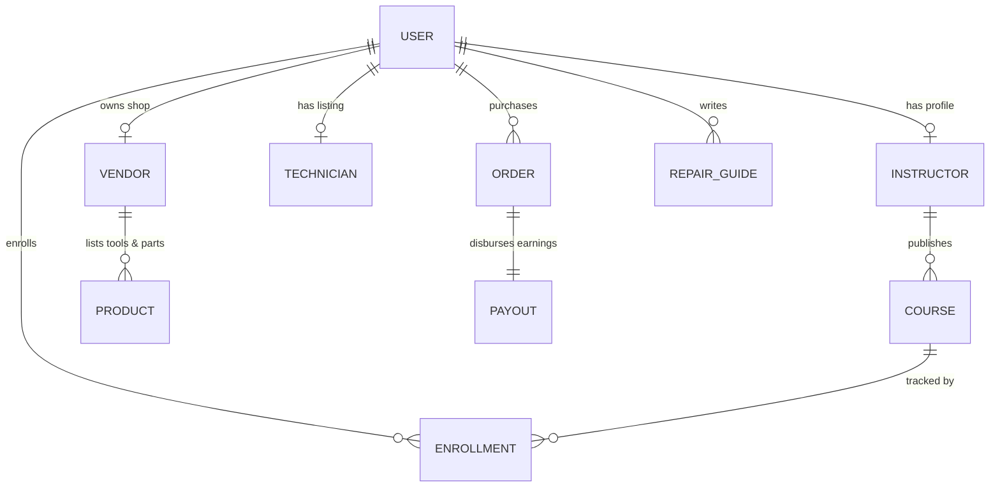

# 05 — Data Model & Tech Plan

Defines the core entities, their key fields, and how they relate — plus a pragmatic tech stack. Grounded in the data the prototype already uses (`data.js`, `repair-data.js`).

---

## A. Core entities

### User (base)

- **Fields:** `id`, `name`, `nameBn`, `email`, `phone`, `role[]`, `avatar`, `verified`, `status` (`active` | `suspended` | `banned`), `joinedAt`, `langs[]`
- **Key Note:** One account can hold multiple roles (learner, instructor, expert).

### Instructor (profile)

- **Fields:** `userId`, `title`, `headline`, `bioBn[]`, `expertise[]`, `cat`, `rating`, `reviewsCount`, `studentsCount`, `coursesCount`, `lifetimeRevenue`, `withdrawableBalance`, `verified`, `location`, `since`

### Course

- **Fields:** `id`, `slug`, `title`, `titleBn`, `blurbBn`, `cat`, `instructorId`, `level`, `price`, `oldPrice`, `lessons`, `hours`, `lang`, `rating`, `ratingsCount`, `students`, `status` (`draft` | `under_review` | `revision` | `published` | `paused`), `productionModel` (`self` | `managed` | `buyout`), `commissionPct` (`self ~ 20` | `managed ~ 55`), `buyoutAmount?`, `bestseller`, `featured`, `submittedAt`, `adminNotes[]`
- **Section Sub-Entity:** `id`, `courseId`, `title`, `order`
- **Lesson Sub-Entity:** `id`, `sectionId`, `title`, `type` (`video` | `quiz` | `assignment`), `duration`, `isPreview`, `videoUrl`

### Category

- **Fields:** `id`, `name`, `nameBn`, `icon`, `hue`, `courseCount`, `enabled`, `parentId?`

### Enrollment

- **Fields:** `id`, `learnerId`, `courseId`, `progress`, `lastLesson`, `enrolledAt`, `completedAt?`, `certificateId?`

### Review

- **Fields:** `id`, `targetType` (`course` | `product` | `expert`), `targetId`, `userId`, `rating`, `textBn`, `createdAt`, `status`

### RepairGuide

- **Fields:** `id`, `slug`, `title`, `titleBn`, `rcat`, `difficulty`, `estCostBDT`, `estTime`, `views`, `successRate`, `authorId`, `status`, `submittedAt`, `body` (`overview`, `symptoms[]`, `causes[]`, `tools[]`, `safety[]`, `steps[]`, `mistakes[]`, `prevention[]`)

### Product (tools & parts)

- **Fields:** `id`, `name`, `brand`, `type` (`tool` | `part`), `price`, `stock`, `rating`, `sellerId`, `sellerType` (`store` | `vendor` | `distributor` | `independent`), `status`, `specs{}`, `compatibility[]`, `oem`, `warranty`, `relatedGuideId?`

### Vendor

- **Fields:** `userId`, `shopName`, `verified`, `productCount`, `salesTotal`, `commissionRate`, `payoutBalance`

### Consultation

- **Fields:** `id`, `expertId`, `learnerId`, `durationMin` (`15` | `30` | `60`), `price`, `scheduledAt`, `status` (`scheduled` | `completed` | `cancelled`), `recordingUrl?`

### ServiceBooking

- **Fields:** `id`, `technicianId`, `customerId`, `serviceType`, `address`, `visitCharge`, `status` (`requested` | `scheduled` | `in_progress` | `completed`), `escrowState`, `warrantyDays`, `rating`

### Technician

- **Fields:** `userId`, `businessName`, `verified`, `serviceTypes[]`, `area`, `completedJobs`, `rating`, `visitCharge`, `docs[]` (`nid` | `tradeLicense`)

### Post (blog / vlog)

- **Fields:** `id`, `slug`, `title`, `type` (`article` | `vlog`), `authorId`, `cat`, `status`, `body`, `videoUrl?`, `views`, `submittedAt`

### ForumThread & Answer

- **Thread Fields:** `id`, `authorId`, `title`, `body`, `cat`, `followers`, `createdAt`
- **Answer Fields:** `id`, `threadId`, `authorId`, `body`, `upvotes`, `isVerifiedExpert`, `isBestAnswer`, `status`

### Order

- **Fields:** `id`, `buyerId`, `itemType` (`course` | `tool` | `part` | `consultation` | `service`), `itemId`, `sellerId`, `amount`, `commission`, `method` (`bkash` | `nagad` | `rocket` | `card`), `status`, `createdAt`

### Payout

- **Fields:** `id`, `payeeId`, `payeeType` (`instructor` | `vendor` | `expert` | `technician`), `amount`, `method`, `status` (`pending` | `processing` | `paid`), `period`

### PlatformSettings (singleton, admin-controlled)

- **Fields:** `commissionRates` (`courseSelf`, `courseManaged`, `store`, `consultation`, `service`), `paymentMethods` (`bkash`, `nagad`, `rocket`, `card`), `sectionsEnabled{...}`, `homepageBanner` (`on`, `text`, `discountPct`)

### ReviewTask (the approval gate)

- **Fields:** `id`, `contentType`, `contentId`, `submittedBy`, `submittedAt`, `status`, `flags[]` (`itemRef`, `note`), `decision`, `decidedBy`, `decidedAt`

---

## B. Key relationships

- **User** 1—N **Course** (as instructor), **RepairGuide**, **Product**, **Post**.
- **Course** 1—N **Section** 1—N **Lesson**; Course N—N **Learner** via **Enrollment**.
- **Category** 1—N **Course** / **RepairGuide**.
- **Order** links **Buyer** $\rightarrow$ any sellable (**Course / Product / Consultation / ServiceBooking**) $\rightarrow$ **Seller**, and generates a **Payout** line + platform **commission**.
- **ReviewTask** references exactly one piece of content; gates `under_review → published`.
- **Review / Rating** roll up into instructor/product/expert aggregate scores + success rates.

---

## C. Status enums (single source of truth)

- **Content:** `draft` · `under_review` · `revision` · `published` · `paused` · `removed`
- **Order:** `placed` · `paid` · `processing` · `shipped` · `delivered` · `scheduled` · `completed` · `refunded`
- **Payout:** `pending` · `processing` · `paid`
- **User:** `active` · `suspended` · `banned`
- **Verification:** `unverified` · `pending` · `verified`

---

## D. Tech stack (pragmatic, BD-ready)

- **Frontend:** React + responsive web (mobile-first); Bangla content, English chrome. Current prototype already React-based.
- **Backend:** REST API in **Go** (1.22+, `chi`/`Echo` router, `pgx`/`sqlc`, `golang-migrate`); PostgreSQL for relational core; Redis + `asynq` for sessions/caching/jobs; object storage (S3-compatible) for video/images. Go ships a single static binary — low memory, high concurrency, cheap to operate.
- **Video:** managed streaming (Mux / Cloudflare Stream / bunny.net) with signed URLs for paid lessons + previews.
- **Payments:** bKash, Nagad, Rocket via aggregator (SSLCommerz/ShurjoPay); card support; escrow ledger for service bookings.
- **Search:** Postgres full-text for MVP $\rightarrow$ Meilisearch/Typesense for problem & course search (Bangla tokenization).
- **AI Repair Assistant:** LLM with retrieval over the guide/course/product corpus; returns causes + linked guides/courses/tools/parts/experts + cost estimate.
- **Auth:** phone-OTP first (BD-friendly) + email; role-based access control (RBAC) for the 7 panels.
- **Admin:** same data, elevated permissions; every state transition is audit-logged.

---

## E. Non-functional priorities

- **Trust:** audit log on all admin actions; verification workflow; escrow for services.
- **Low-bandwidth:** adaptive video, light pages, offline-friendly downloads.
- **Bangla-first:** correct rendering (Hind Siliguri), Bangla search tokenization, BDT formatting (৳).
- **Scalability:** content tables partitioned by type; read replicas for browse/search.
- **Moderation at scale:** review queue with bulk actions, flagging, and reputation-weighted trust.
