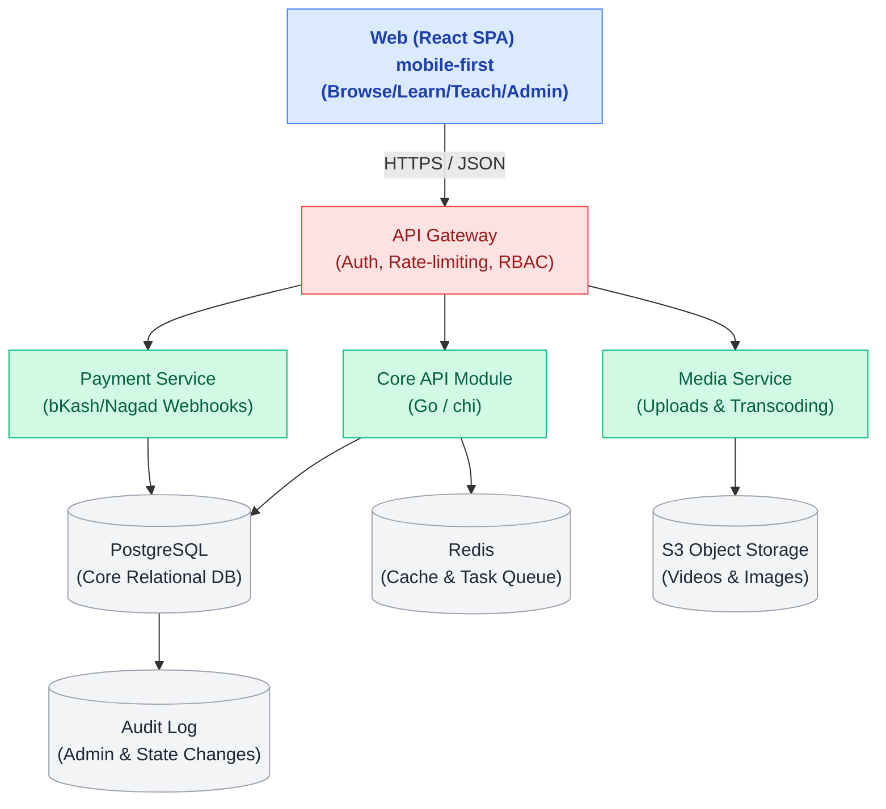

# 09 — MVP Technical Plan (Engineering)

Engineering-only view of the **MVP** (Phase 1 + Repair Hub). Goal: ship a trust-gated Bangla course marketplace + text-first repair hub that a small team can build and operate in ~10–12 weeks. Everything public passes an **admin review gate** before going live.

> MVP scope = **Browse + Learn + Teach (3 creation models) + Repair Hub + Admin review/control + payments**. Out of MVP: store, parts, consultations, services, forum, AI assistant (P1–P2).

---

## 1. Architecture (high level)



**Pattern for MVP:** a **modular monolith** — one deployable **Go** Core API binary with clear package boundaries (cmd/internal/modules) + a separate **Go media worker** for transcode jobs. Split into services only when load demands it. Go gives a single static binary, low memory, fast cold starts, and first-class concurrency for media/webhook workloads — cheap and simple to operate.

---

## 2. Stack decisions

| Layer         | Choice                                                                         | Why                                                           |
| ------------- | ------------------------------------------------------------------------------ | ------------------------------------------------------------- |
| Frontend      | React + Vite, TypeScript, React Router, TanStack Query                         | prototype is React; SPA fits panels                           |
| UI            | existing component system + CSS vars (from prototype)                          | reuse, Bangla-ready (Hind Siliguri)                           |
| API           | **Go** (1.22+) — `chi` or `Echo` router, `sqlc`/`pgx` for DB, `golang-migrate` | single static binary, low RAM, high concurrency, cheap to run |
| DB            | PostgreSQL 15                                                                  | relational core, full-text search for MVP                     |
| Cache/queue   | Redis + **`asynq`** (Go task queue)                                            | sessions, rate-limit, transcode/notification jobs             |
| Storage       | S3-compatible (Cloudflare R2 / AWS)                                            | assets, signed URLs                                           |
| Video         | Mux / Cloudflare Stream / bunny.net                                            | HLS, signed playback, adaptive bitrate                        |
| Search        | Postgres FTS → Meilisearch                                                     | Bangla tokenization at scale                                  |
| Auth          | phone-OTP (primary) + email; JWT access + refresh                              | BD-friendly                                                   |
| Payments      | SSLCommerz / ShurjoPay (bKash, Nagad, Rocket, card)                            | local aggregators                                             |
| Hosting       | containers on a BD-reachable region + CDN                                      | latency, cost                                                 |
| Observability | Sentry + structured logs + uptime ping                                         | catch issues early                                            |

---

## 3. Services / modules (MVP)

1. **Auth & Users** — OTP login, sessions, RBAC, profiles, verification status.
2. **Catalog** — courses, sections, lessons, categories; search & filter.
3. **Authoring** — course builder, 3 production models, draft → submit.
4. **Review (the gate)** — ReviewTask queue, inspect, flag, approve/revision/reject; audit log.
5. **Enrollment & Learning** — enroll, progress, certificates.
6. **Repair Hub** — guides, contributor builder, helpful/success voting.
7. **Payments & Ledger** — checkout, webhooks, commission split (self 20% / managed 55% / buyout one-time), payouts.
8. **Media** — upload, transcode, signed playback, preview clips.
9. **Notifications** — SMS/email/in-app for OTP, review decisions, payout status.
10. **Admin** — same data, elevated scope; settings (commissions, sections, payments, banner), suspend/ban, feature/unpublish.

---

## 4. Core API surface (representative)

```
POST   /auth/otp/request           POST /auth/otp/verify
GET    /courses?cat&level&q&sort   GET  /courses/:slug
POST   /courses (draft)            PATCH /courses/:id   POST /courses/:id/submit
POST   /enrollments                GET  /me/learning
GET    /guides?rcat&q              GET  /guides/:slug   POST /guides  POST /guides/:id/submit
POST   /checkout/:courseId         POST /payments/webhook   (aggregator callback)
# admin (RBAC: admin)
GET    /admin/review?type&status   POST /admin/review/:id/approve | /revision | /reject
PATCH  /admin/settings             POST /admin/users/:id/suspend
GET    /admin/orders?from&to       GET  /admin/payouts
```

All list endpoints: cursor pagination, server-side filter/sort. All writes: validated, authorized, audit-logged.

---

## 5. Data & integrity (see Doc 05 for full schema)

- Entities: User, Instructor, Course/Section/Lesson, Category, Enrollment, RepairGuide, Order, Payout, ReviewTask, PlatformSettings, AuditLog.
- **Course** carries `productionModel(self|managed|buyout)`, `commissionPct`, `buyoutAmount?`, `status`.
- **State machine enforced server-side:** `draft → under_review → (published | revision | rejected) → paused/removed`. No client can set `published` — only an admin `approve` transition can.
- **Money:** store amounts in integer paisa; commission computed at order time from PlatformSettings; every payout traces to orders.
- **Idempotency:** payment webhooks keyed by aggregator txn id; enrollment unique per (user, course).

---

## 6. Security & trust

- RBAC middleware per route; row-level checks (instructor can only edit own courses).
- Signed, expiring URLs for paid video; previews are public, full lessons gated by enrollment.
- OTP rate-limiting; refresh-token rotation; input validation everywhere.
- **Audit log** on every admin action and content state change (who/what/when) — core to the trust story.
- PII (phone, NID for technicians later) encrypted at rest; least-privilege access.

---

## 7. Build sequence (~10–12 weeks)

| Wk  | Deliverable                                                           |
| --- | --------------------------------------------------------------------- |
| 1   | Repo, CI/CD, infra, design-system port, auth scaffold                 |
| 2   | OTP auth + RBAC + user profiles + admin shell                         |
| 3–4 | Catalog: course/section/lesson models, browse, search, course detail  |
| 4–5 | Authoring: course builder + 3 production models + submit              |
| 5–6 | **Review gate**: ReviewTask queue, approve/revision/reject, audit log |
| 6–7 | Media: upload + transcode + signed playback + previews                |
| 7–8 | Payments: checkout, webhooks, enrollment, commission ledger           |
| 8   | Learning: progress, certificates, learner dashboard                   |
| 9   | Repair Hub: guides + contributor builder + voting                     |
| 10  | Admin: settings, orders, payouts, suspend/feature                     |
| 11  | Hardening: security, perf, low-bandwidth, QA, Bangla QA               |
| 12  | Beta seed (50–100 courses), bug-fix, soft launch                      |

---

## 8. Testing & QA

- Unit (services, commission math, state transitions), integration (API + DB), E2E (Playwright on the 3 critical flows: enroll, build→review→publish, read a guide).
- **Payment sandbox** runs before any real money; webhook replay tests.
- Bangla rendering + RTL-free layout checks; mobile breakpoints; slow-3G profiling.
- Load test browse/search and review queue before launch.

---

## 9. DevOps & environments

- **Envs:** local → staging → prod; seeded demo data on staging.
- Containerized (small Go binary in a scratch/distroless image); one-command deploy; DB migrations versioned (`golang-migrate`).
- Backups: daily Postgres snapshots + asset bucket versioning; restore runbook.
- Monitoring: Sentry (errors), uptime checks, dashboards for GMV/queue-age/payment-success.

---

## 10. MVP "done" definition (engineering)

- All three creation models work end-to-end; nothing goes live without an admin approve transition (enforced server-side + audited).
- Learner can enroll (real sandbox payment), watch gated video, track progress, get a certificate.
- Repair guide can be authored, reviewed, published, and searched in Bangla.
- Admin can review every content type, set commissions/sections, see orders & payouts, suspend/ban.
- p95 page < 2.5s on 3G-class connections; error budget instrumented.
