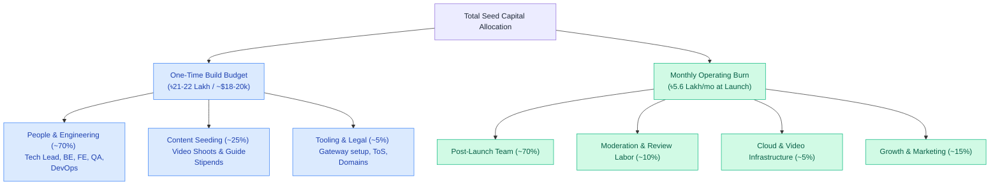

# 12 — Cost & Infrastructure Budget (MVP)

Monthly burn estimate to build and run the MVP, then operate at early scale. **All figures are planning estimates (BDT ৳ / USD $)** — validate with live vendor quotes. Assumes the lean team and modular-monolith infra from Docs 09–10.

---

## A. One-time build cost (≈3 months to soft-launch)

Dominated by people. Team from Doc 10 for ~12 weeks.

| Role                         | Monthly (৳)      | 3 months        |
| ---------------------------- | ---------------- | --------------- |
| Tech lead / full-stack       | 1,50,000         | 4,50,000        |
| Backend engineer             | 1,00,000         | 3,00,000        |
| Frontend engineer            | 1,00,000         | 3,00,000        |
| QA / moderation              | 60,000           | 1,80,000        |
| PM / founder                 | (founder equity) | —               |
| Designer (0.5, front-loaded) | 50,000           | 1,50,000        |
| DevOps (fractional 0.25)     | 30,000           | 90,000          |
| **People subtotal**          |                  | **~৳14,70,000** |

**Content seeding (curated launch):** instructor incentives + Managed Production for 50–100 courses + 20–30 repair guides.

- Managed shoots/edits (say 20 courses × ৳15,000) ≈ ৳3,00,000
- Buy-outs (5 evergreen × ৳40,000) ≈ ৳2,00,000
- Repair-guide stipends ≈ ৳50,000
- **Content subtotal ≈ ৳5,50,000**

**One-time tooling/setup:** domains, business reg, design assets, legal (ToS/privacy), payment-gateway onboarding ≈ **৳1,50,000**

> **Build total ≈ ৳21–22 lakh** (~$18–20k) to soft-launch. People are ~70% of it.

---

## B. Monthly infrastructure (at launch → early scale)

Cloud + SaaS. Two columns: **Launch** (~5k MAU, small catalog) and **Scale** (~50k MAU).

| Item                              | Launch (৳/mo) | Scale (৳/mo)   | Notes                                          |
| --------------------------------- | ------------- | -------------- | ---------------------------------------------- |
| Compute (API + worker containers) | 6,000         | 35,000         | 1–2 small instances → autoscale                |
| PostgreSQL (managed)              | 4,000         | 20,000         | HA + read replica at scale                     |
| Redis (cache/queue)               | 2,000         | 8,000          | managed                                        |
| Object storage (S3/R2)            | 1,500         | 12,000         | course assets, growing                         |
| **Video streaming + egress**      | 8,000         | 90,000         | **biggest variable** — scales with watch-hours |
| CDN                               | 2,000         | 15,000         | static + HLS edge                              |
| Search (PG FTS → Meilisearch)     | 0             | 9,000          | FTS free at launch                             |
| SMS (OTP + notifications)         | 4,000         | 30,000         | per-message; OTP-heavy                         |
| Email                             | 1,000         | 4,000          | transactional                                  |
| Monitoring (Sentry/uptime)        | 2,000         | 6,000          |                                                |
| Backups                           | 1,000         | 4,000          | snapshots + bucket versioning                  |
| **Infra subtotal**                | **~৳31,500**  | **~৳2,33,000** |                                                |

> **Video + SMS dominate variable cost.** Both scale with usage, so unit economics must cover them (see Doc 08).

---

## C. Ongoing monthly operating cost (post-launch)

| Bucket                                      | Launch (৳/mo) | Scale (৳/mo) |
| ------------------------------------------- | ------------- | ------------ | -------------------------- |
| Team (reduced post-build: ~3 eng + QA + PM) | 4,00,000      | 6,00,000     |
| Infrastructure (from B)                     | 31,500        | 2,33,000     |
| **Moderation/review staff**                 | 60,000        | 2,50,000     | scales with content volume |
| Payment processing fees                     | ~2–3% of GMV  | ~2–3% of GMV |
| Marketing (lean early)                      | 50,000        | 5,00,000+    |
| Misc (legal, tools, support)                | 20,000        | 60,000       |
| **Monthly burn (excl. fees)**               | **~৳5.6L**    | **~৳16–18L** |

---

## D. Cost drivers & levers

1. **Video egress/streaming** — biggest scale cost. Levers: adaptive bitrate, aggressive CDN caching, cap default resolution, lazy-load, consider regional storage.
2. **SMS/OTP** — levers: rate-limit OTP, prefer WhatsApp/email where possible, batch notifications.
3. **Moderation labor** — the trust gate's cost. Levers: bulk review actions, reputation-weighted fast-track for trusted contributors, templates, later ML pre-filtering.
4. **Payment fees** — fixed % of GMV; negotiate rates as volume grows.

---

## E. Cost-control principles

- **Modular monolith first** — avoid premature microservice/infra sprawl (Doc 09).
- **Pay-as-you-grow** managed services; no idle reserved capacity at launch.
- **Free tiers** for low-volume needs early (FTS, basic monitoring, email).
- **Feature flags** to keep P1/P2 (store, services, AI) off until funded — they add infra cost.
- Watch **cost-per-active-learner**; keep it well under LTV (Doc 08 target LTV:CAC ≥ 3:1).

---

## F. Runway planning (illustrative)

- Build + 6 months runway at launch burn ≈ ৳22L + (6 × ৳5.6L) ≈ **৳55–56 lakh (~$48–50k)** to reach a validated curated launch with traction data.
- This frames the seed ask in Doc 08 §G — fund **build + content seeding + ~6–9 months runway** to hit the MVP success milestones before scaling spend.

> **Disclaimer:** salaries, gateway %, and especially video/SMS rates vary widely — replace every number with a real quote before committing. This is a structure for budgeting, not a guarantee.
